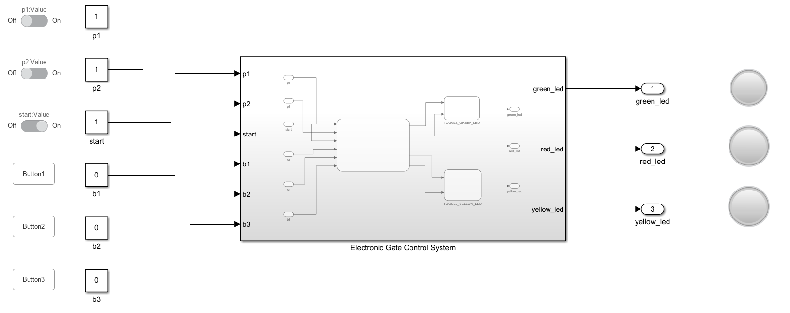

  <h1>⚡🚗🌳 Automated Gate Control Firmware</h1>

*Model-based firmware development for a dual-leaf electronic gate using MATLAB Stateflow, automated C code generation via Embedded Coder, and deployment on STM32 NUCLEO-G474RE*

[📚 Overview](#-overview) • [🏗️ System Architecture](#-system-architecture) • [⚙️ Inputs & Outputs](#-inputs--outputs) • [🧪 Validation](#-validation) • [🚀 Deployment](#-deployment)

---

## 📚 Project Overview

This project presents the design and implementation of a firmware for a **dual-leaf electronic gate** (cancello a battenti), developed as part of the *Sistemi Embedded* course at the University of Salerno (A.Y. 2023/2024). The system controls gate movement, obstacle detection, LED signaling, and automatic timing through a model-based approach using MATLAB Stateflow. C code is then automatically generated via Embedded Coder and deployed on the **STM32 NUCLEO-G474RE** development board.

The control logic is modeled as a hierarchical state machine that handles gate opening and closing, proximity-based obstacle detection, configurable working and closing timers, error state management, and LED feedback. All behaviors were first verified through MATLAB Test Harness simulations before being deployed to hardware.

---

## 🏗️ System Architecture

The control system (`ElectronicGateControlSystem`) is structured as a set of parallel Stateflow charts:

- **GATE** — Core state machine managing gate behavior (INACTIVE → ACTIVE → ISCLOSING / ISOPENING / OPEN / CLOSE / STOPSYSTEM / ERRORSTATE)
- **B1, B2, B3** — Button debounce super-states, each with RELEASED → PRESSED → LONGPRESSED transitions to prevent bouncing
- **CLOSINGTIME** — Manages auto-close timer (10s to 120s, incremented by 10s via B2)
- **WORKINGTIME** — Manages gate movement duration (10s to 120s, incremented by 10s via B3)
- **TOGGLEGREENLED** — LED toggling chart (SWITCH / BLINKING) for the green LED
- **TOGGLEYELLOWLED** — LED toggling chart for the yellow LED

  

The main state machine starts in `ISCLOSING` on power-on to handle the case where the gate is open when the board is powered. If proximity sensor **P1** detects an obstacle during closing, the gate automatically reverses to opening. If sensor **P2** does not activate within the working time during a closing phase, the system enters `STOPSYSTEM` and then `ERRORSTATE` after 10 seconds, blocking all inputs until a manual reset via P2.

---

## ⚙️ Inputs & Outputs

### Inputs

| Signal | Description |
|--------|-------------|
| `b1` | Level-triggered push button — opens/closes the gate |
| `b2` | Level-triggered push button — increments auto-close timer |
| `b3` | Level-triggered push button — increments working time |
| `p1` | Proximity sensor (active-low) — obstacle detection |
| `p2` | Closure sensor (active-low) — confirms gate fully closed |

### Outputs

| Signal | Description |
|--------|-------------|
| `greenled` | Green LED physical state (on / off) |
| `yellowled` | Yellow LED physical state (on / off / blinking at 0.5 Hz during movement) |
| `redled` | Red LED — solid on during error state |

---

## 🔁 Control Logic Summary

The gate operates according to the following behavioral rules:

- **B1** opens or closes the gate. Pressing B1 mid-movement reverses direction (if no obstacle is present).
- **B2** increments the auto-close timer by 10s (max 120s, then wraps to 10s). Only works when gate is closed.
- **B3** increments working time by 10s (max 120s, then wraps to 10s). Only works when gate is closed.
- **P1 active during closing** → gate stops and reverses to opening.
- **P1 active when gate is open/closed + B1 pressed** → command ignored, green LED blinks for 30s.
- **Auto-close timer** is suspended while P1 detects an obstacle; resumes after obstacle removal.
- **Error state**: triggered if P2 does not activate within the working time during closing. System blocks all inputs; red LED turns on after 10s. Resolved only by manually activating P2.
- **Power-on**: if gate is open (P2 not active), automatic closing procedure starts immediately.

---

## 🧪 Validation

The model was validated using **MATLAB Test Harness**, with 19 test scenarios covering all user stories and activity diagrams defined in the design phase:

| Test | Description |
|------|-------------|
| LED toggling | Continuous on/off and blink sequence |
| Open/Close via B1 | Normal gate operation with P2 confirmation |
| Auto-close | Automatic closing after timer expiry |
| Interrupt during opening/closing | B1 reversal behavior |
| Working time increment | B3 multi-press and wrap-around |
| Auto-close timer increment | B2 multi-press and wrap-around |
| Obstacle during closing | P1 triggers reversal to open |
| Obstacle during opening | B1 command ignored |
| Obstacle with gate open/closed | Green LED blinking for 30s |
| LED blink interruption | P1 deactivation stops green LED |
| LED blink reset | B1 re-press restarts 30s countdown |
| Error state management | Block → STOPSYSTEM → ERRORSTATE → reset via P2 |

---

## 🚀 Deployment

The firmware was deployed on the **STM32 NUCLEO-G474RE** board. The Simulink model was adapted for deployment by removing the simulated `start` input and the `INACTIVE` state (not needed in hardware, since the board is simply powered on), and by removing all simulation-only I/O blocks (Switch, Button, Lamp) from the Simulink setup before generating code via **Embedded Coder**.

### Pin Mapping (STM32 NUCLEO-G474RE)

| Component | Pin |
|-----------|-----|
| B1 (Open/Close) | PC8 |
| B2 (Auto-close timer) | PC6 |
| B3 (Working time) | PC5 |
| P1 (Proximity sensor) | PC10 |
| P2 (Closure sensor) | PC12 |
| Green LED | PB3 |
| Yellow LED | PB4 |
| Red LED | PB5 |
